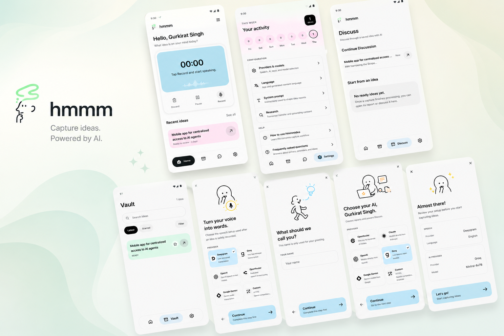

# Hmmmidea

> Local-first, voice-first idea capture for Android. Speak an idea, walk away, and come back to a structured report you can search, question, and share.

<!-- Hero screenshot of the capture screen -->


Hmmmidea turns a fleeting thought into a **structured, searchable idea report** without forcing you to organize anything up front. You open the app, tap record, and talk. In the background, durable on-device jobs transcribe your words and shape them into a report with a gist, evidence, risks, and a next move.

Everything stays on your device:

- **SQLite** stores captures, reports, discussions, and job state.
- **App storage** keeps optional source audio.
- **Android SecureStore** keeps your provider keys, out of app data and exports.
- **No account and no required backend.** Remote speech and AI services are called directly — only for transcription, research, report generation, and discussion.

## Features

- **Capture** — a low-friction recorder right on the home screen, with live transcription, pause/resume, and your three latest captures.
- **Vault** — searchable, sortable archive of your ideas and their reports.
- **Idea Detail** — a sectioned report (gist, evidence, risk check, next move, original words) with PDF export.
- **Discuss** — question, challenge, and refine any idea with your configured AI provider.
- **Onboarding** — a short setup that wires up your own speech and AI providers.
- **Settings** — providers, language, notifications, web research, data export, and privacy.

## Requirements

- **Bun 1.4+** — the package manager and script runner for this project (Node/npm/npx are not used).
- **Android** development build — voice recording and protected credentials are Android-first. Expo Go may not support the recording module.
- **User-supplied provider credentials** — you bring your own speech-to-text, AI, and (optionally) search API keys.

## Getting started

```bash
bun install
bun run start
```

Open on a connected Android device directly:

```bash
bun run android
```

Routes live under `src/app` (Expo Router), and the `@/` alias resolves to `src`.

## Validation

```bash
bun run typecheck   # TypeScript, no emit
bun run lint        # ESLint (Expo config)
bun test            # Bun test runner
bun run format      # Prettier (write)
bun run format:check
bun run docs:audit  # JSDoc header audit
bunx expo-doctor    # Expo diagnostics
```

Run the full check set before any build.

## Project structure

```text
src/
  app/          Expo Router routes and navigation layouts
  components/   shared presentational UI
  features/     feature logic — captures, recording, jobs, providers, discussion, settings, export
  constants/    stable product and design constants
  assets/       brand marks, icons, onboarding artwork
docs/           architecture, design, and development decisions
scripts/        repo tooling (e.g. the JSDoc header audit)
tests/          Bun tests
```

## Releasing

Tag the commit you want to ship; the [release workflow](.github/workflows/android-release.yml) builds the APK, runs the full validation set, and attaches the artifact to a GitHub Release.

```bash
git tag v1.0.0
git push origin v1.0.0
```

The tag name becomes both the release name and the APK filename (`hmmm-v1.0.0.apk`). The normal push of `main` also builds an APK as a CI artifact (see [android-build.yml](.github/workflows/android-build.yml)), but only a `v*` tag publishes a formal Release.

## Developer conventions

See [docs/CONVENTIONS.md](docs/CONVENTIONS.md) for the full set. The essentials:

- **TypeScript** for all application source, strict mode.
- **Bun** for installing and running — add packages with `bun add`, never by hand-editing `package.json`.
- **JSDoc file headers** on every source and test file: `@file`, `@description`, `@author`, `@license`. Enforced by `bun run docs:audit`.
- **Phosphor icons** only — no React Icons or Lucide.
- **Design source of truth** lives in [docs/Design.md](docs/Design.md).

## Documentation

- [Architecture](docs/ARCHITECTURE.md) — product areas, runtime, data model, provider and security boundaries.
- [Design](docs/Design.md) — the visual system: color, typography, spacing, shape, interaction, accessibility.
- [Conventions](docs/CONVENTIONS.md) — how the codebase is written, documented, and checked.

## License

Released under the [MIT License](LICENSE).
